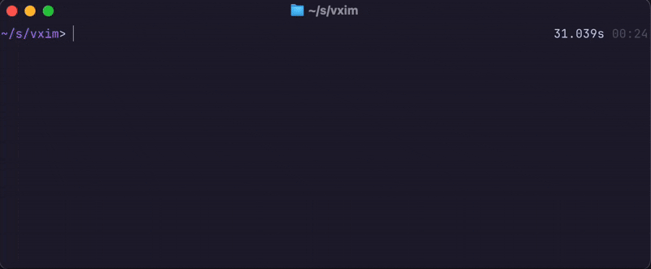

# vxim

vxim is currently an experiment to make an immediate-mode framework for [libvaxis](https://github.com/rockorager/libvaxis). If it turns out to be viable &mdash; and it's very promising so far! &mdash; I plan to use this for writing the TUI for my editor project: [Fönn](https://tangled.org/@reykjalin.org/fn).

## Demo



Code for the recording is in [src/demo.zig](./src/demo.zig).

## Features

The framework isn't very feature complete, and likely won't be for some time. I plan to add widgets as I need them while working on [Fönn](https://tangled.org/@reykjalin.org/fn), but contributions are welcome!

Current widgets included:
  * `button`
  * `text`
  * `window`
  * `padding`
  * `menuBar`

All widgets handle mouse events and focus automatically. They have some minor customization options, but for the most part they're pretty limited at the moment.

## Contributing

Contributions are welcome through [GitHub pull requests](https://github.com/reykjalin/vxim), [Tangled pulls](https://tangled.org/@reykjalin.org/vxim), or email patches.

## Implementation details

The implementation of `vxim` draws heavily from [DVUI](https://github.com/david-vanderson/dvui), but with a distinct flavor that fits better with how `libvaxis` works.

The biggest difference is that `vxim` does not render frames in a continuous loop, queue up events, and then send them all at once to the update function. Instead, the update function you pass to `vxim` will only get called when the terminal receives an event you've subscribed to.

This means `vxim` doesn't operate on a "frame", and as such isn't like (most?) other immediate mode UI libraries, like DVUI, Dear Imgui, and others. Instead it's entirely event based and connected to interactions with the terminal. That said, using `vxim` still feels like using a regular immediate mode library.

### Widget IDs

Every focusable widget must have an ID. Unlike DVUI &mdash; which uses [@src()](https://ziglang.org/documentation/0.15.2/#toc-src) and the widget hierarchy to generate widget IDs &mdash; you can make up a type for your widget IDs and pass it to `vxim`. It'll then be used by all the widget functions in `vxim`.

I recommend a simple enum:

```zig
enum Widget {
  AppWindow,
  OkButton,
  CancelButton,
}
```

but you can go as crazy with this as you'd like.

### Mouse focus and clicks

To handle clicks properly, without them bleeding through elements stacked on top of one another, I borrowed the concept of what I've called "mouse focus" from DVUI &mdash; a different name, but same concept.

Whenever a mouse click is performed each widget will receive a `.mouse_focus` event. If a widget receives this event it'll be set as the currently mouse-focused widget. Once the `.mouse_focus` event has been sent, it'll be immediately followed by the `.mouse` click event.

What this does is ensure that the last element drawn in the update loop will be mouse-focused by the time we send the `.mouse` click event on the next call to the update function. Clicks are only processed for the element that currently has mouse focus.

#### Known bugs with mouse focus and clicks

There is currently [a bug](https://tangled.org/@reykjalin.org/vxim/issues/8) in the implementation that means you must subscribe to `.mouse_focus` by including it in your event struct so that the event gets delivered to all the widgets you're using. If you don't, focus won't be handled correctly and clicks won't be delivered at all. This should be a compile-time error, but it currently is not.

I plan to fix this soon.
